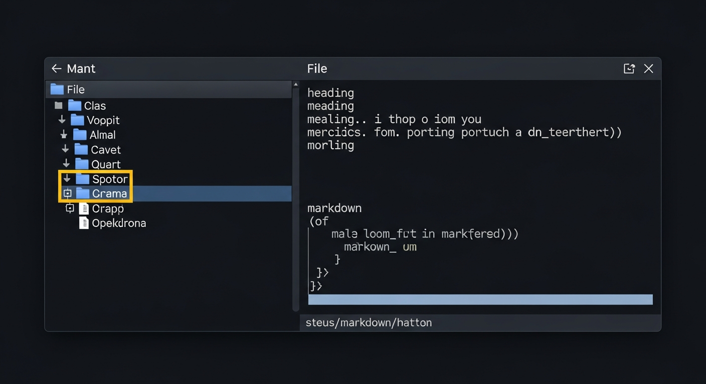

# terminal

A terminal file browser built with [FrankenTUI](https://github.com/Dicklesworthstone/frankentui) featuring mouse support and markdown rendering.



## Install

```bash
curl -sSf https://raw.githubusercontent.com/l0g1x/terminal/main/install.sh | bash
```

That's it. Installs Rust if needed, builds from source, and puts `terminal` on your PATH.

## Usage

```bash
# Browse the current directory
terminal

# Browse a specific directory
terminal /path/to/dir
```

## Features

- **Split-pane layout** -- directory tree on the left, file preview on the right
- **Mouse support** -- click to select/expand tree nodes, scroll wheel navigation
- **Markdown rendering** -- `.md` files rendered with styled headings, bold, italic, code blocks, lists, links, and tables
- **Plain text preview** -- non-markdown files shown with word wrapping
- **Lazy directory loading** -- subdirectories are read only when expanded
- **Scrollbar** -- vertical scrollbar in the preview pane when content overflows
- **Status bar** -- displays filename, size, and keyboard shortcuts

## Keyboard Shortcuts

| Key | Action |
|-----|--------|
| `Up` / `k` | Navigate up in tree / scroll preview up |
| `Down` / `j` | Navigate down in tree / scroll preview down |
| `Enter` / `Right` / `l` | Expand directory or open file |
| `Backspace` / `Left` / `h` | Collapse directory or switch to tree |
| `Tab` | Switch focus between tree and preview panes |
| `PageUp` / `PageDown` | Jump 10 items or scroll a full page |
| `Home` / `End` | Go to first/last item |
| `q` / `Esc` | Quit |

## Architecture

Built on FrankenTUI's Elm/Bubbletea architecture (`Model` trait):

- **Layout** -- `Flex::horizontal()` splits tree (30%) and preview (70%); `Flex::vertical()` separates the status bar
- **Tree** -- `Tree` widget with `TreeGuides::Rounded` and lazy-loaded `TreeNode` hierarchy
- **Preview** -- `Paragraph` widget with `WrapMode::Word` and `Scrollbar`
- **Markdown** -- `MarkdownRenderer` from `ftui-extras` with panic-safe fallback for complex LaTeX math
- **Mouse** -- `ProgramConfig::fullscreen().with_mouse()` enables full mouse capture; tree uses `handle_mouse()` hit testing

## License

MIT
